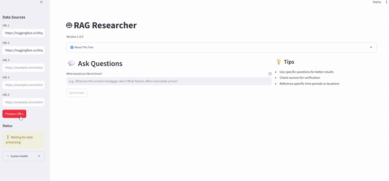
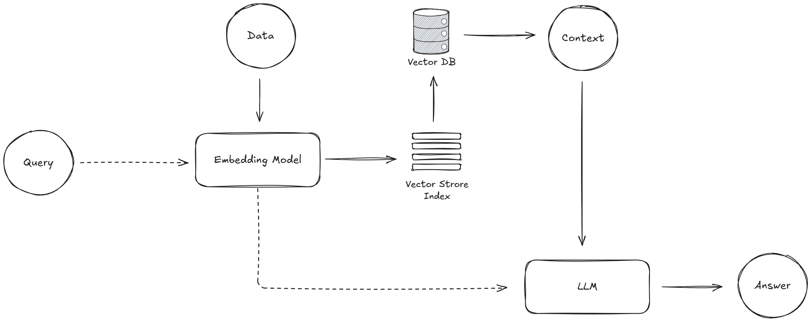

# RAG Researcher
A production-ready AI-powered research tool for professionals, investors, and enthusiasts. Extract insights from web articles, reports, and documents using advanced RAG (Retrieval Augmented Generation) technology.



## Features
* Extract insights from multiple web sources with natural language queries
* AI-powered answers using Llama 3.3 via Groq with semantic search
* Source citations included for transparency
* Real-time processing with live status updates
* Secure by design: input validation, sanitization, and rate limiting

## Advanced Features
* **Query History**: Track, revisit, and build on previous questions and answers.
* **Health Monitoring**: View system status, performance, and component health in real time.
* **Collection Management**: Manage processed documents, reset the vector DB, and monitor storage usage.

## Architecture


## System Requirements
* CPU: 2+ cores recommended
* Memory: 4GB+ RAM for optimal performance
* Storage: 10GB+ for vector database and logs
* Network: Stable internet for API calls

## Installation

1. **Clone the repository**:

```
git clone https://github.com/lintosunny/rag-research-assistant.git
```

2. **Create and activate a virtual environment (optional but recommended)**:

```
conda create -n env python=3.10 -y
```

```
conda activate env
```

3. **Install Dependencies**:

```
pip install -r requirements.txt
```

4. **Setup your API Key**:

Create a ```.env``` file in the root directory and add your Groq API key:

```
GROQ_API_KEY=your_groq_api_key_here
```

5. **Run the App**
```
streamlit run main.py
```
Once started app will be open in your default web browser.

## User Guide

1. Enter Up to 5 URLs: *Add article, blog, or report links in the sidebar. Make sure the website allow webscraping*

2. Click "Process URLs": *The app will fetch and convert content into vector embeddings.*

3. Ask Your Question: *Use the main input box to ask anything about the loaded content.*

4. Get Answers with Sources: *The app returns precise, AI-generated answers with source citations.*

## Getting Help

* Issues: Report bugs on GitHub Issues
* Discussions: Use GitHub Discussions for questions
* Contact: lintosunny111@gmail.com

## License
This project is licensed under the MIT License 


